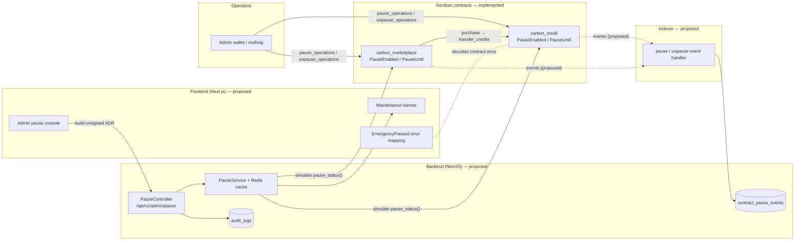

# Pause Feature — Specification

> **Status:** Contract layer implemented · Backend, database and frontend layers proposed
> **Owners:** Contracts Lead (on-chain), Backend Lead (API/DB), Frontend Lead (UI)
> **Related:** [Testing checklist](./TESTING_CHECKLIST.md) · [Deployment checklist](./DEPLOYMENT_CHECKLIST.md) · [Release notes](./RELEASE_NOTES.md) · [Contract exploit runbook](../runbooks/contract-exploit.md) · [Role authorization audit](../../audit/role-authorization.md)

This document covers the emergency pause across every CarbonLedger stack. Sections are tagged:

- **[Implemented]**: describes code that is on `main` today. Section references point to the source.
- **[Proposed]**: a design that is not built yet. It needs its own issue and PR before anyone relies on it.

---

## 1. Overview

The pause feature is a time-boxed circuit breaker. An administrator uses it to stop state-changing operations on a Soroban contract during an incident, such as a suspected exploit, a bad oracle feed or a serial-number conflict. It gives responders a safe window to investigate without new bad state being written on-chain.

The feature is:

- **Per-contract.** `carbon_credit` and `carbon_marketplace` each have their own pause flag. Pausing one does not change the other's flag.
- **Time-boxed.** Every pause has a deadline no more than **72 hours** away. It lifts on its own when that deadline passes.
- **Admin-only.** Only the contract admin can pause or unpause.
- **Write-only.** Read and query functions keep working while a contract is paused.

`carbon_registry`, `carbon_oracle` and `carbon_zk_verifier` do **not** have a pause mechanism today.

## 2. Requirements

### 2.1 Functional requirements

| ID | Requirement | Status |
|----|-------------|--------|
| FR-1 | An admin can pause a contract until a given ledger timestamp. | Implemented |
| FR-2 | The pause deadline must be later than the current ledger time and no more than 72 h after it. | Implemented |
| FR-3 | While paused, gated functions fail with `EmergencyPaused`. | Implemented |
| FR-4 | The pause lifts on its own once the ledger timestamp reaches the deadline. | Implemented |
| FR-5 | An admin can unpause early at any time. Unpausing is idempotent. | Implemented |
| FR-6 | Read-only functions are never blocked by the pause. | Implemented |
| FR-7 | Role management (`grant_role` / `revoke_role`) stays available while paused, so a compromised key can be rotated. | Implemented (credit) |
| FR-8 | Pause and unpause emit contract events that the indexer can consume. | Proposed |
| FR-9 | Each pausable contract exposes a read-only `pause_status()` view. | Proposed |
| FR-10 | The backend exposes pause status and admin pause/unpause endpoints. | Proposed |
| FR-11 | The frontend shows a banner while paused and a clear message on `EmergencyPaused`. | Proposed |
| FR-12 | Every pause and unpause is recorded in the audit log with a reason. | Proposed |

### 2.2 Non-functional requirements

| ID | Requirement |
|----|-------------|
| NFR-1 | Checking the pause adds no more than 2 persistent storage reads to each gated call. |
| NFR-2 | An operator can pause within 5 minutes of deciding to (see §8). |
| NFR-3 | Off-chain pause status is at most 30 s stale (see §8). |
| NFR-4 | A pause never locks funds permanently: the 72 h cap and the admin's ability to unpause guarantee recovery. |

## 3. Architecture



### 3.1 Cross-contract propagation [Implemented]

`carbon_marketplace::purchase_credits` and `bulk_purchase` call `carbon_credit::transfer_credits` through `env.invoke_contract`. If **only `carbon_credit`** is paused:

- The marketplace pause check passes.
- The nested `transfer_credits` call fails with credit's `EmergencyPaused` (code **29**).
- The whole transaction rolls back, so no USDC moves.

As a result, **pausing `carbon_credit` stops marketplace purchases as well**. Listing and delisting still work in that case, because they only use marketplace state.

## 4. Contract specification [Implemented]

### 4.1 Storage

Both contracts store the pause in **persistent** storage under these `DataKey` variants:

| Key | Type | Meaning | Initial value (`initialize`) |
|-----|------|---------|------------------------------|
| `DataKey::PauseEnabled` | `bool` | Pause flag was set | `false` (credit). Marketplace does not write it; reads default to `false`. |
| `DataKey::PauseUntil` | `u64` | Ledger timestamp (Unix seconds) when the pause ends | `0` |

A contract is **effectively paused** only when `PauseEnabled == true && PauseUntil > ledger.timestamp()`. Off-chain readers must apply this full check. Reading `PauseEnabled` alone is not enough, because the flag stays `true` after expiry until the next gated call clears it (§4.3).

### 4.2 Admin functions

```rust
pub fn pause_operations(env: Env, admin: Address, until_timestamp: u64) -> Result<(), CarbonError>
pub fn unpause_operations(env: Env, admin: Address) -> Result<(), CarbonError>
```

| | `pause_operations` | `unpause_operations` |
|---|---|---|
| Auth | `admin.require_auth()` + admin role (`require_role(Admin)` in credit, `require_admin` in marketplace) | same |
| Validation | `now < until_timestamp <= now + 259_200` (72 h) or `InvalidPauseWindow` | none |
| Effect | `PauseEnabled = true`, `PauseUntil = until_timestamp` | `PauseEnabled = false`, `PauseUntil = 0` |
| Gated by pause? | No. It can be called while paused to extend or shorten the window. | No |
| Events | **None.** `carbon_credit/tests/events.rs` asserts that none are emitted. | **None** |

### 4.3 Guard: `require_not_paused`

```rust
fn require_not_paused(env: &Env) -> Result<(), CarbonError> {
    let paused = PauseEnabled.unwrap_or(false);
    let until  = PauseUntil.unwrap_or(0);
    if paused && until > now { return Err(EmergencyPaused); }
    if paused && until <= now { PauseEnabled = false; PauseUntil = 0; } // lazy clear
    Ok(())
}
```

Expiry is **lazy**. No transaction fires when the deadline passes. The first gated call after expiry resets the flags as part of its own write set. If that call later fails for another reason, the reset rolls back with it, but the guard still passes because `until <= now`.

### 4.4 Gated functions

| `carbon_credit` | `carbon_marketplace` |
|---|---|
| `mint_credits` | `list_credits` |
| `retire_credits` | `delist_credits` |
| `transfer_credits` | `purchase_credits` |
| `undo_retire` | `bulk_purchase` |
| `upgrade_contract` | `upgrade_contract` |
| `set_max_history_entries` | `set_fee_rate` |
| `set_oracle_contract` | `update_treasury` |
| `set_verified_periods` | `suspend_project` |
| `set_vintage_year_bounds` | `set_vintage_year_bounds` |
| `migrate_serial_index` | `set_sweep_threshold` |
| | `sweep_fees` |
| | `cleanup_expired_listings` |

**Not gated:** `initialize`, `pause_operations`, `unpause_operations`, every `get_*`/view function. Also not gated: `grant_role`, `revoke_role` and `has_role` on credit, and `set_oracle_contract` and `set_price_freshness_window` on marketplace.

> ⚠️ `upgrade_contract` is gated. **A contract must be unpaused before a fix can be deployed by upgrade.** See the deployment checklist rollback section.

### 4.5 Error codes

| Contract | `InvalidPauseWindow` | `EmergencyPaused` |
|---|---|---|
| `carbon_credit` | 28 | 29 |
| `carbon_marketplace` | 26 | 27 |

The numbers differ between contracts. Clients must decode errors using the contract that raised them. See `frontend/lib/carbon-error-codes.ts`, which at the time of writing does **not** include these codes.

### 4.6 Proposed contract additions [Proposed]

1. `pub fn pause_status(env: Env) -> PauseStatus { paused: bool, until: u64 }`. This is a read-only view that applies the full effective-pause check from §4.1.
2. Events for pause and unpause, following the `(c_ledger, <sym>)` topic convention in [contract-events.md](../contract-events.md):
   - `(c_ledger, paused)` → `(admin, until_timestamp)`
   - `(c_ledger, unpaused)` → `admin`

   `events.rs` EVT-NOEVENT-02/03 must be updated in the same PR.
3. Move `require_not_paused` after the admin check in `update_treasury` and `suspend_project` (audit finding M-1).

## 5. API specification [Proposed]

These routes follow the existing `AdminController` conventions: `@Controller('admin')`, `@Roles('admin')`, `PoliciesGuard`, and versioning per [api-versioning.md](../api-versioning.md). The backend **never holds the admin signing key**. It returns unsigned transaction XDR that the admin signs in Freighter or a multisig, and then submits.

### 5.1 `GET /api/v1/status/pause` (public)

Returns the effective pause state of each pausable contract. The result is cached in Redis for 30 s.

```json
{
  "contracts": {
    "carbon_credit":      { "paused": true,  "until": "2026-10-01T12:00:00Z", "reason": "Oracle incident INC-142" },
    "carbon_marketplace": { "paused": false, "until": null, "reason": null }
  },
  "checkedAt": "2026-09-30T15:04:05Z"
}
```

`reason` comes from the audit log, because the contract does not store one.

### 5.2 `POST /api/v1/admin/pause/:contract/prepare` (admin)

Request:

```json
{ "untilTimestamp": 1790000000, "reason": "Suspected double-mint, INC-142" }
```

| Field | Rule |
|---|---|
| `:contract` | `carbon_credit` or `carbon_marketplace` |
| `untilTimestamp` | integer seconds, `now < t <= now + 259200` (checked early to fail fast; the contract has the final say) |
| `reason` | required, 10–500 characters |

Response `200`: `{ "xdr": "<unsigned tx>", "simulation": { "fee": "...", "result": "ok" } }`
Errors: `400` for an invalid window or reason, `403` if the caller is not an admin, `422` if simulation fails (the contract error code is included).

### 5.3 `POST /api/v1/admin/unpause/:contract/prepare` (admin)

Request: `{ "reason": "Root cause fixed in PR #1234" }`. The response has the same shape as §5.2.

### 5.4 `POST /api/v1/admin/pause/submit` (admin)

Request: `{ "signedXdr": "...", "action": "pause" | "unpause", "contract": "...", "reason": "..." }`

Submits the signed transaction through the existing Stellar service, waits for it to be final, writes an `audit_logs` row with `txHash`, clears the Redis cache and returns `{ "txHash": "...", "status": {...} }`.

### 5.5 Error mapping for all existing write endpoints

If a Soroban call fails with `EmergencyPaused`, the API returns **`503 Service Unavailable`** with a `Retry-After` header set to the seconds until `until`:

```json
{ "statusCode": 503, "error": "ContractPaused", "contract": "carbon_credit", "until": "2026-10-01T12:00:00Z" }
```

## 6. Database schema [Proposed]

No schema change is required for the contract feature itself. On-chain storage is the source of truth. Two off-chain additions are proposed.

### 6.1 Audit trail: reuse `audit_logs`

Write to the existing `AuditLogEntry` model (`@@map("audit_logs")`). No migration is needed.

| Column | Value |
|---|---|
| `actor_id` | admin Stellar public key |
| `action` | `contract.pause` / `contract.unpause` |
| `resource_type` | `contract` |
| `resource_id` | `carbon_credit` / `carbon_marketplace` |
| `details` | `{ "untilTimestamp", "reason", "txHash", "contractId", "network" }` |

### 6.2 Indexed history: new `contract_pause_events` table

This table is populated by the indexer once the contract events from §4.6 exist.

```prisma
model ContractPauseEvent {
  id             String    @id @default(cuid())
  contractName   String    // carbon_credit | carbon_marketplace
  contractId     String
  action         String    // paused | unpaused | expired
  admin          String?
  untilTimestamp DateTime? @db.Timestamptz(6)
  txHash         String?   @unique
  ledger         Int
  createdAt      DateTime  @default(now()) @db.Timestamptz(6)

  @@index([contractName, createdAt])
  @@map("contract_pause_events")
}
```

The migration must follow [database-migration-policy.md](../database-migration-policy.md). It is additive only and safe for zero downtime.

## 7. UI/UX requirements [Proposed]

| ID | Requirement |
|----|-------------|
| UX-1 | While any contract is paused, show a global, non-dismissible **maintenance banner**: "Trading and retirements are temporarily paused while we investigate an issue. Expected to resume by {local time}." Use `role="status"` and `aria-live="polite"`. |
| UX-2 | Disable **Buy**, **List**, **Delist**, **Retire** and **Transfer** buttons for the affected contract, with a tooltip explaining why. Remember that pausing credit also blocks purchases (§3.1). |
| UX-3 | Browsing, portfolio, certificates and the audit explorer stay fully usable. |
| UX-4 | Add codes 28/29 (credit) and 26/27 (marketplace) to `carbon-error-codes.ts`, so a call that races the banner shows "Operations are temporarily paused" and not a generic error. |
| UX-5 | Admin console: a pause form with contract, duration (1 h / 6 h / 24 h / 72 h presets or custom, capped at 72 h) and a required reason. Add a confirmation dialog that asks the admin to type the contract name. |
| UX-6 | Admin console: show a live countdown to auto-expiry, plus "Extend" and "Unpause now" actions. |
| UX-7 | Poll `GET /status/pause` every 30 s. Hide the banner as soon as the pause lifts. |
| UX-8 | Translate every new string through the existing `i18n` setup. |

## 8. Performance requirements

| ID | Requirement | Notes |
|----|-------------|-------|
| PR-1 | Guard overhead: ≤ 2 persistent reads per gated call, plus 2 writes only on the first call after expiry | Implemented. Verify with `benchmarks/` and the gas report. |
| PR-2 | `pause_operations` fits within default Soroban resource limits with headroom (> 50 %) | Two persistent writes |
| PR-3 | `GET /status/pause` p95 < 50 ms (cache hit), < 500 ms (cache miss / RPC simulate) | Proposed |
| PR-4 | Status freshness ≤ 30 s (Redis TTL + frontend poll) | Proposed |
| PR-5 | Pause decision to on-chain confirmation ≤ 5 min, including multisig signing | Operational target |
| PR-6 | During a pause, API write endpoints fail fast with 503 and do not spend RPC fees resubmitting | Proposed |

## 9. Security considerations

1. **Admin key is a single point of control.** Anyone holding the admin key can pause for up to 72 h and then re-pause indefinitely, which is a denial of service. Mitigate with a multisig admin (see `contracts/upgrade_governance`), alert on every pause (§4.6 events), and use [key-compromise runbook](../runbooks/key-compromise.md) rotation. `grant_role`/`revoke_role` are deliberately left ungated on credit so this recovery path works.
2. **The 72 h cap limits admin power** and guarantees users regain access even if the admin is unavailable.
3. **Upgrades are gated.** An attacker who gains admin cannot upgrade while paused, but neither can responders. Responders must unpause first, which reopens the attack surface for one or more ledgers. Plan the unpause → upgrade → re-pause sequence and submit the transactions back-to-back.
4. **Pause-state oracle (audit M-1).** In `update_treasury` and `suspend_project` the pause check runs before the admin check, so a non-admin caller can learn from the error which state the contract is in. The impact is low, because the state is public anyway. Fix is proposed in §4.6.
5. **Not every stack is covered.** Registry and oracle cannot be paused. A compromised oracle must be handled with `rotate_oracle` and the [oracle-failure runbook](../runbooks/oracle-failure.md).
6. **No on-chain reason.** The reason for a pause exists only in the off-chain audit log. Its integrity depends on the hash-chained `AuditLog` (#674).
7. **Backend never signs.** The proposed API only builds and relays transactions. Signing stays in the admin's wallet.
8. **Lazy expiry.** Monitoring must compute the effective state (§4.1). Relying on the raw `PauseEnabled` flag would report a stale pause.

## 10. Out of scope

- Pausing individual functions. The pause is contract-wide.
- Pausing `carbon_registry`, `carbon_oracle` or `carbon_zk_verifier`.
- Keeping a paused state across a redeploy to a new contract ID.
